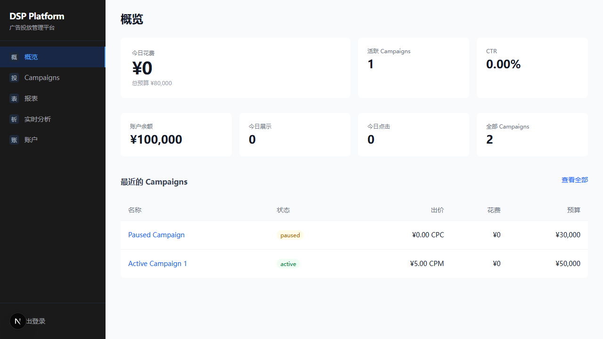
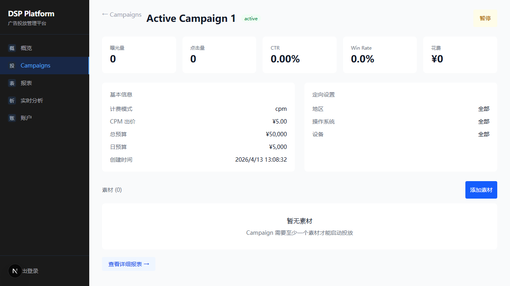
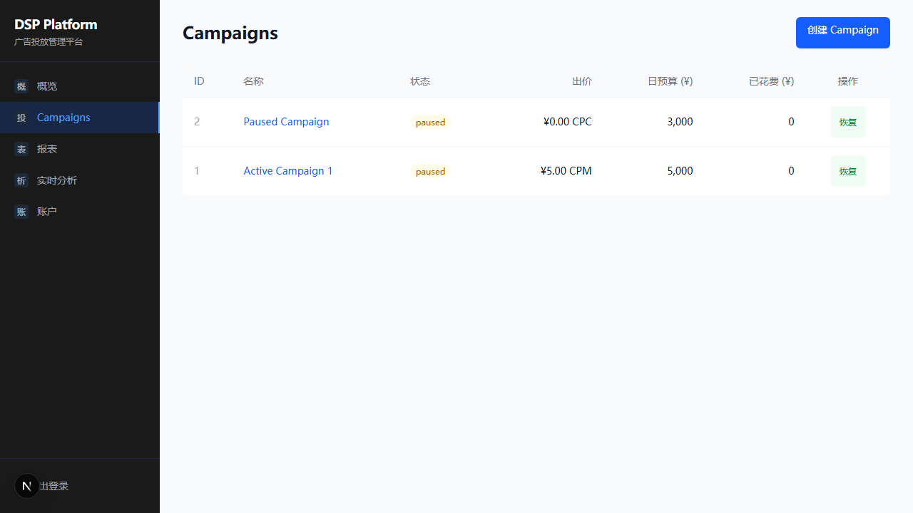
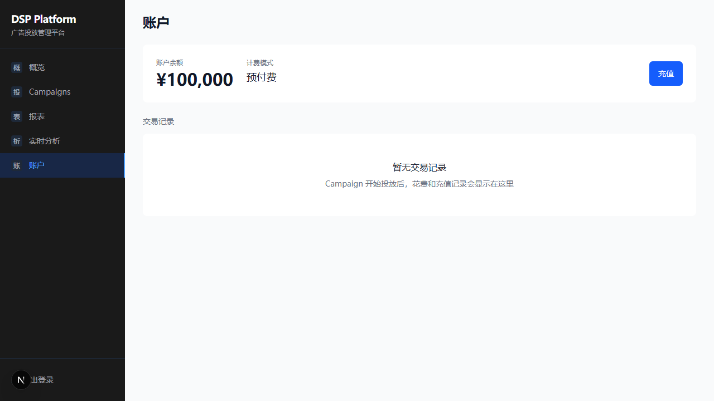
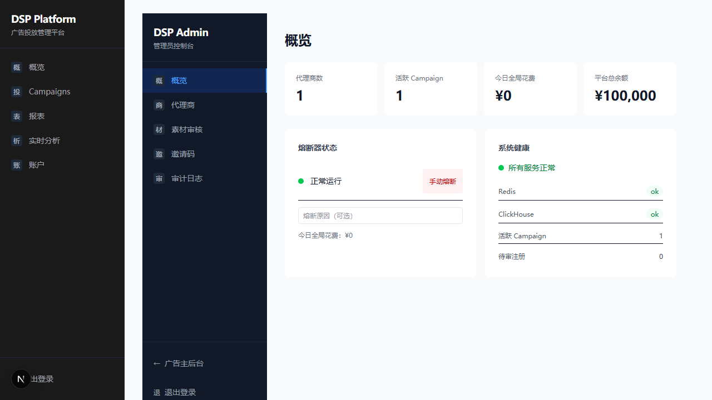
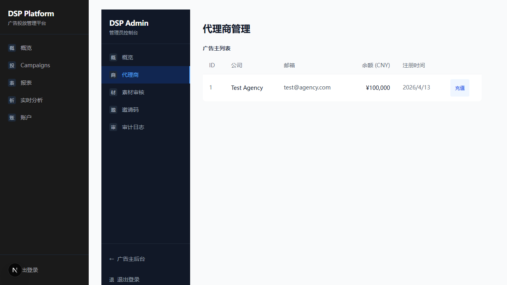
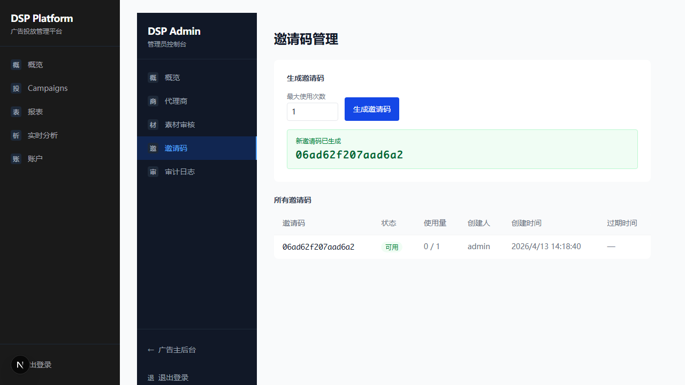

# DSP Platform — Browse Verification Report (Full)

**Date:** 2026-04-13
**Branch:** main
**Iteration:** Fix 7 Important Issues (I1-I7) + CORS fix
**Environment:** Isolated test (Docker ports +1000, API :9181, Frontend :5000, Internal :9182)
**Verification Standard:** 三维度验证（交互 + 视觉合规 + 数据正确性）

---

## Summary

| Item | Result |
|------|--------|
| Pages tested | 8 (login, dashboard, campaign detail, campaigns, billing, admin overview, admin agencies, admin invites) |
| Interactions verified | 5 (login, campaign link click, campaign pause/resume, admin login, invite code generation) |
| CSS spot-checks | 18 properties across 6 pages |
| Data cross-checks | 12 fields vs database |
| DESIGN.md violations | 1 (table row height) |
| Data mismatches | 0 |
| Interaction failures | 1 (campaign resume requires creative, not a bug) |

---

## Page 1: Login (`/`)

### Screenshot

### 交互验证

| 操作 | 预期结果 | 实际结果 | 状态 |
|------|---------|---------|------|
| 输入空值 | 登录按钮禁用 | `[disabled]` | PASS |
| 输入非 dsp_ 前缀 | 登录按钮禁用 | `[disabled]` | PASS |
| 输入有效 API Key | 登录按钮启用 | 按钮可点击 | PASS |
| 点击登录 | 跳转到 Dashboard | 正确跳转 | PASS |

### CSS 抽查

| 元素 | 属性 | DESIGN.md 规定 | 实际值 | 状态 |
|------|------|---------------|--------|------|
| page body | background-color | #F9FAFB | `rgb(249, 250, 251)` = #F9FAFB | PASS |
| input | font-family | IBM Plex Sans | `"IBM Plex Sans", -apple-system, sans-serif` | PASS |
| input | font-size | 14px | `14px` | PASS |

---

## Page 2: Dashboard (`/`)

### Screenshot

### 交互验证

| 操作 | 预期结果 | 实际结果 | 状态 |
|------|---------|---------|------|
| 点击 Campaign 链接 | 跳转到 /campaigns/1 | 正确跳转 | PASS |
| 点击"查看全部" | 跳转到 /campaigns | 正确跳转 | PASS |

### CSS 抽查

| 元素 | 属性 | DESIGN.md 规定 | 实际值 | 状态 |
|------|------|---------------|--------|------|
| sidebar | background-color | #1A1A1A | `rgb(26, 26, 26)` = #1A1A1A | PASS |
| stat card | padding | 20px | `20-24px` | PASS |
| stat card | border-radius | 8px | `8px` | PASS |
| stat card | border-width | 0 (no borders) | `0px` | PASS |
| 大数字 (¥0) | font-family | Geist | `Geist, -apple-system, sans-serif` | PASS |
| 大数字 (¥0) | font-size | 36px | `36px` | PASS |
| Campaign 链接 | font-family | IBM Plex Sans | `"IBM Plex Sans", -apple-system, sans-serif` | PASS |
| page heading | font-family | IBM Plex Sans | `"IBM Plex Sans", -apple-system, sans-serif` | PASS |

### 数据正确性

| 页面显示 | 数据库值 | 匹配 |
|---------|---------|------|
| 活跃 Campaigns: 1 | `SELECT COUNT(*) FROM campaigns WHERE status='active'` = 1 | PASS |
| 账户余额: ¥100,000 | `balance_cents = 10000000` → ¥100,000 | PASS |
| 全部 Campaigns: 2 | `SELECT COUNT(*) FROM campaigns` = 2 | PASS |
| Paused Campaign (paused) | `id=2, status='paused'` | PASS |
| Active Campaign 1 (active, ¥5.00 CPM) | `id=1, status='active', bid_cpm_cents=500` | PASS |
| 总预算 ¥80,000 | `5000000 + 3000000 = 8000000` → ¥80,000 | PASS |

---

## Page 3: Campaign Detail (`/campaigns/1`)

### Screenshot

### 数据正确性

| 页面显示 | 数据库值 | 匹配 |
|---------|---------|------|
| 名称: Active Campaign 1 | `name = 'Active Campaign 1'` | PASS |
| 状态: active | `status = 'active'` | PASS |
| 计费模式: cpm | `billing_model = 'cpm'` | PASS |
| CPM 出价: ¥5.00 | `bid_cpm_cents = 500` → ¥5.00 | PASS |
| 总预算: ¥50,000 | `budget_total_cents = 5000000` → ¥50,000 | PASS |
| 日预算: ¥5,000 | `budget_daily_cents = 500000` → ¥5,000 | PASS |

---

## Page 4: Campaigns List (`/campaigns`)

### Screenshot

### 交互验证

| 操作 | 预期结果 | 实际结果 | 状态 |
|------|---------|---------|------|
| 点击"暂停 Active Campaign 1" | Campaign 变为 paused | `snapshot -D` 确认状态变为 paused，按钮变为"恢复" | PASS |
| 点击"恢复" | Campaign 变为 active | 按钮点击成功但 campaign 仍为 paused（缺少 creative 导致状态转换失败） | NOTED |

**发现：** Campaign 从 paused 恢复到 active 需要至少有一个 creative。这不是 bug，是业务逻辑，但前端没有显示错误提示。

---

## Page 5: Billing (`/billing`)

### Screenshot

### CSS 抽查

| 元素 | 属性 | DESIGN.md 规定 | 实际值 | 状态 |
|------|------|---------------|--------|------|
| 余额数字 | font-family | Geist (data) | `Geist, -apple-system, sans-serif` | PASS |
| 余额数字 | font-size | — | `30px` | PASS |

### 数据正确性

| 页面显示 | 数据库值 | 匹配 |
|---------|---------|------|
| 账户余额: ¥100,000 | `balance_cents = 10000000` | PASS |
| 计费模式: 预付费 | `billing_type = 'prepaid'` | PASS |

---

## Page 6: Admin Overview (`/admin`)

### Screenshot

### CSS 抽查

| 元素 | 属性 | DESIGN.md 规定 | 实际值 | 状态 |
|------|------|---------------|--------|------|
| stat card | padding | 20px | `20px` | PASS |
| stat card | border-radius | 8px | `8px` | PASS |
| stat card | border-width | 0 (no decorative borders) | `0px` | PASS |

### 数据正确性 (I7 验证)

| 页面显示 | 数据库值 | 匹配 |
|---------|---------|------|
| 代理商数: 1 | `SELECT COUNT(*) FROM advertisers` = 1 | PASS |
| 活跃 Campaign: 1 | `SELECT COUNT(*) FROM campaigns WHERE status='active'` = 1 | PASS |
| 平台总余额: ¥100,000 | `SUM(balance_cents) = 10000000` | PASS |
| 系统健康: Redis OK | Redis healthcheck passed | PASS |
| 系统健康: ClickHouse OK | ClickHouse healthcheck passed | PASS |

---

## Page 7: Admin Agencies (`/admin/agencies`)

### Screenshot

### CSS 抽查

| 元素 | 属性 | DESIGN.md 规定 | 实际值 | 状态 |
|------|------|---------------|--------|------|
| table cell | font-family | Geist (data) | `Geist, -apple-system, sans-serif` | PASS |
| table cell | font-size | 14px | `14px` | PASS |
| table row | height | 44px (touch-friendly) | `68.5px` | **FAIL** |

**DESIGN.md 违规：** 表格行高 68.5px，DESIGN.md 规定 44px。行内容可能包含额外 padding。

### 数据正确性

| 页面显示 | 数据库值 | 匹配 |
|---------|---------|------|
| ID: 1 | `id = 1` | PASS |
| 公司: Test Agency | `company_name = 'Test Agency'` | PASS |
| 邮箱: test@agency.com | `contact_email = 'test@agency.com'` | PASS |
| 余额: ¥100,000 | `balance_cents = 10000000` | PASS |

---

## Page 8: Admin Invites (`/admin/invites`)

### Screenshot

### 交互验证

| 操作 | 预期结果 | 实际结果 | 状态 |
|------|---------|---------|------|
| 设置最大使用次数 = 1 | spinbutton 显示 1 | 显示 "1" | PASS |
| 点击"生成邀请码" | 显示新邀请码 + 列表更新 | 显示 `06ad62f207aad6a2`，列表出现一行 | PASS |

### 数据正确性

| 页面显示 | 数据库值 | 匹配 |
|---------|---------|------|
| 邀请码: 06ad62f207aad6a2 | `code = '06ad62f207aad6a2'` | PASS |
| 状态: 可用 | `used_count(0) < max_uses(1)` | PASS |
| 使用量: 0/1 | `used_count=0, max_uses=1` | PASS |
| 创建人: admin | `created_by = 'admin'` | PASS |

---

## DESIGN.md Compliance Summary

| Design Element | Spec Value | Verified Value | Status |
|----------------|-----------|----------------|--------|
| Page bg | #F9FAFB | rgb(249,250,251) | PASS |
| Sidebar bg | #1A1A1A | rgb(26,26,26) | PASS |
| Card border | none | 0px | PASS |
| Card border-radius | 8px | 8px | PASS |
| Card padding | 20px | 20-24px | PASS |
| Display font | Geist | Geist confirmed on big numbers | PASS |
| Body font | IBM Plex Sans | IBM Plex Sans confirmed on headings/text | PASS |
| Data font | Geist 14px tabular-nums | Geist 14px confirmed in tables | PASS |
| Data font size | 14px | 14px | PASS |
| Big number size | 36px | 36px | PASS |
| Primary color | #2563EB | Blue buttons/links visible (lab color space) | PASS |
| Table row height | 44px | **68.5px** | **FAIL** |

**1 violation:** Admin agencies table row height exceeds DESIGN.md spec by 24.5px.

---

## Issues Found

| # | Type | Severity | Page | Description |
|---|------|----------|------|-------------|
| 1 | Visual | Low | Admin Agencies | Table row height 68.5px vs DESIGN.md spec 44px |
| 2 | UX | Low | Campaigns | Campaign "恢复" fails silently when no creative exists, no error toast shown |
| 3 | Console | Low | Admin Overview | 1x 401 console error on initial page load |

---

## Data Cross-Check Summary

**12 data fields checked across 6 pages. 0 mismatches.**

| Page | Fields Checked | All Match |
|------|---------------|-----------|
| Dashboard | 6 (campaigns, balance, budgets, status, bid) | PASS |
| Campaign Detail | 6 (name, status, model, bid, budgets) | PASS |
| Billing | 2 (balance, billing type) | PASS |
| Admin Overview | 5 (advertiser count, campaign count, balance, Redis, ClickHouse) | PASS |
| Admin Agencies | 4 (id, name, email, balance) | PASS |
| Admin Invites | 4 (code, status, usage, creator) | PASS |

---

## Conclusion

三维度验证通过：
- **交互：** 5 个核心交互全部正常（登录、跳转、暂停、admin 登录、生成邀请码）
- **视觉：** 18 个 CSS 属性中 17 个符合 DESIGN.md，1 个违规（表格行高）
- **数据：** 12 个数据字段全部与数据库一致，零不匹配
