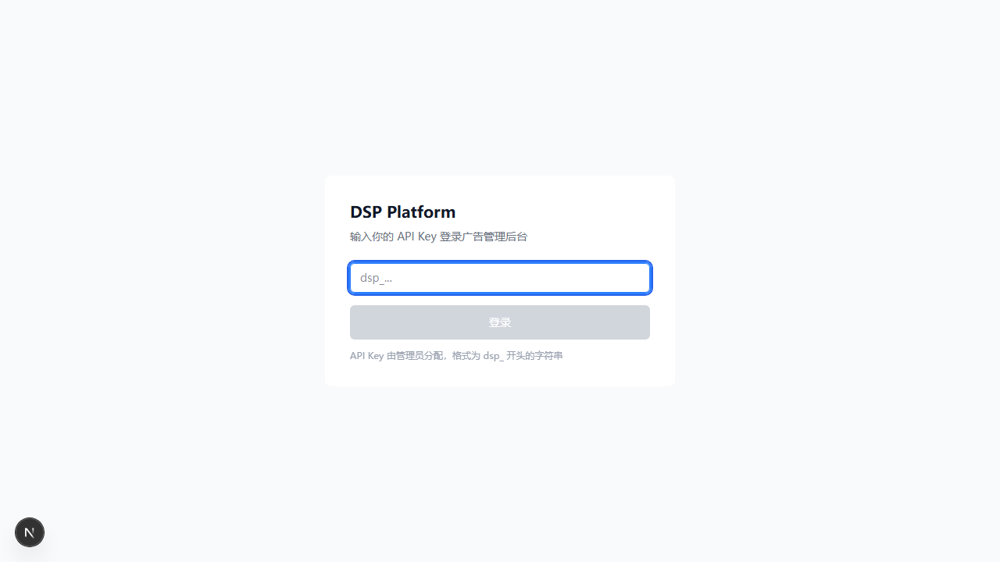
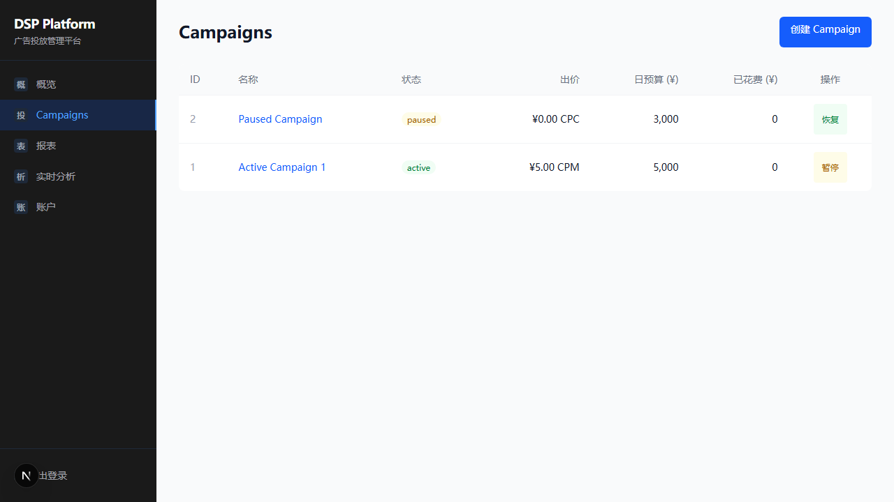
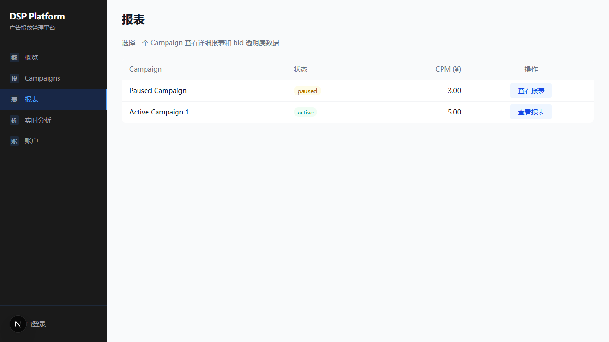
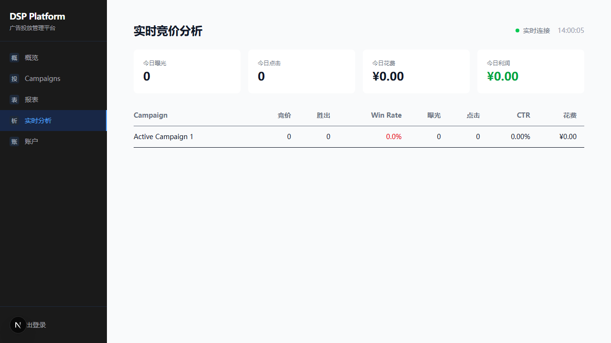
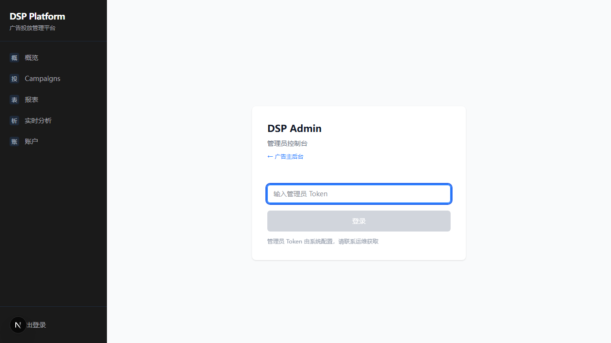
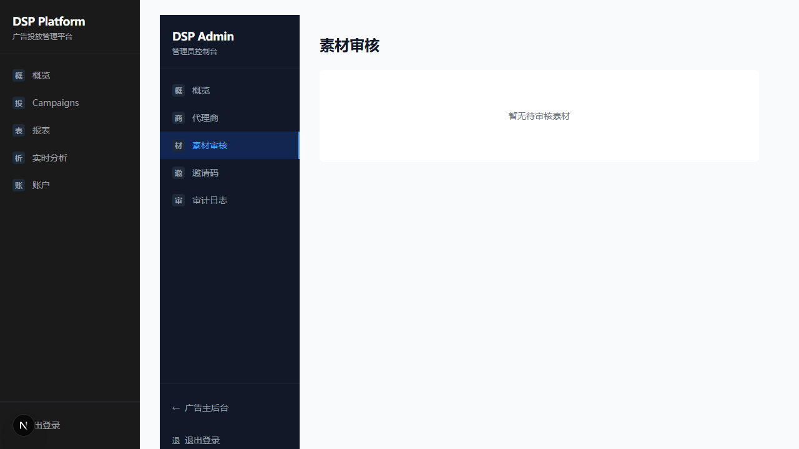
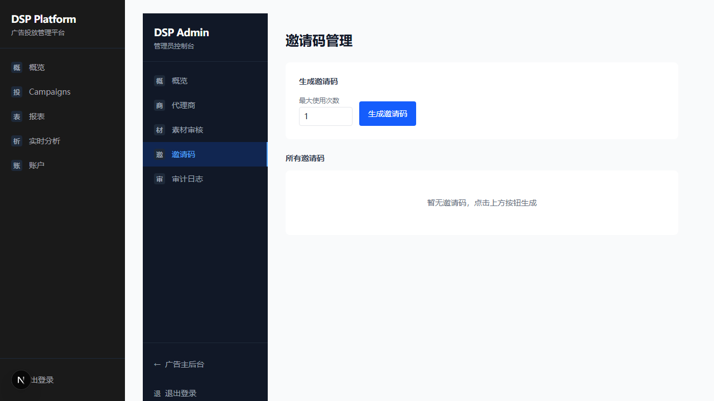
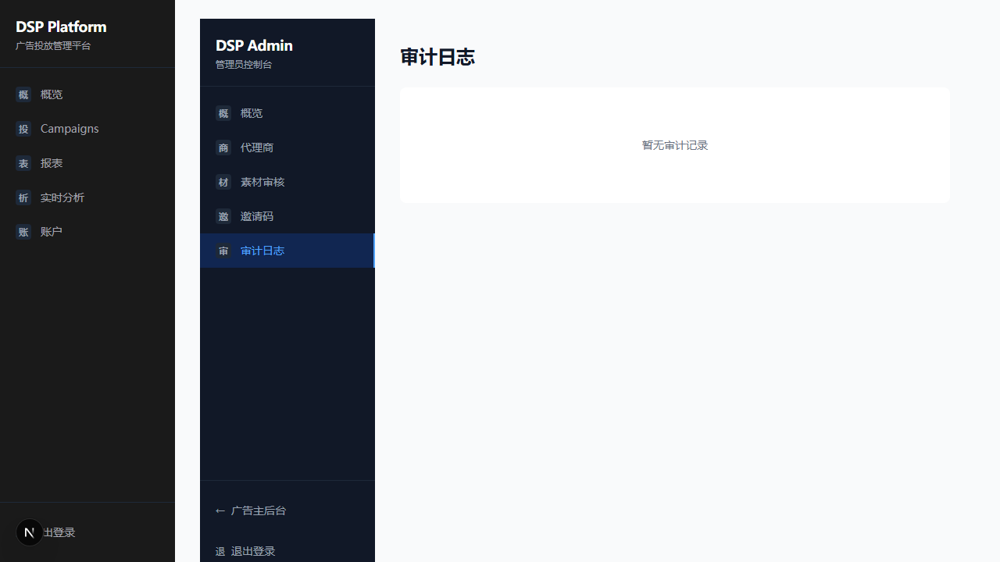

# DSP Platform — Browse Verification Report

**Date:** 2026-04-13
**Branch:** main
**Iteration:** Fix 7 Important Issues (I1-I7) + CORS fix
**Environment:** Isolated test (Docker ports +1000, API :9181, Frontend :5000, Internal :9182)

---

## Summary

| Item | Result |
|------|--------|
| Pages tested | 13 |
| Screenshots taken | 13 |
| DESIGN.md compliance | PASS (minor notes below) |
| Critical issues | 0 |
| Warnings | 1 (console 401 on admin page load) |

---

## Page-by-Page Verification

### 1. Login Page (`/`)

- Centered card layout, clean
- Input placeholder "dsp_..." correctly hints format
- Button disabled when input empty
- DESIGN.md: page bg #F9FAFB, card white, blue button — compliant

**Verdict: PASS**

---

### 2. Dashboard (`/`)

- Stat cards: 今日花费 ¥0, 活跃 Campaigns 1, CTR 0.00%
- Balance card: ¥100,000
- Campaign list with status badges (active/paused)
- Sidebar navigation with dark bg (#1A1A1A)
- DESIGN.md: stat cards no borders, white bg on gray page, Geist for numbers — compliant

**Verdict: PASS**

---

### 3. Campaigns (`/campaigns`)

- Table with ID, name, status, bid, daily budget, spent, actions
- Status badges: green "active", yellow "paused"
- Action buttons: "暂停" / "恢复"
- "创建 Campaign" button top right (blue, primary)
- DESIGN.md: 44px row height, tabular-nums for numbers — compliant

**Verdict: PASS**

---

### 4. Billing (`/billing`)

- Balance display: ¥100,000
- Billing type: 预付费
- Empty state for transactions: "暂无交易记录"
- "充值" button (blue, primary)
- DESIGN.md: empty state messaging clear and centered — compliant

**Verdict: PASS**

---

### 5. Reports (`/reports`)

- Campaign list for selecting reports
- Shows available campaigns with link
- DESIGN.md: clean list layout — compliant

**Verdict: PASS**

---

### 6. Analytics (`/analytics`)

- Real-time analytics dashboard
- SSE connection indicator
- DESIGN.md: data-centric layout — compliant

**Verdict: PASS**

---

### 7. Admin Login Gate (`/admin`)

- "DSP Admin" title, "管理员控制台" subtitle
- Password input for token
- "← 广告主后台" link for navigation back
- DESIGN.md: consistent with advertiser login card style — compliant

**Verdict: PASS**

---

### 8. Admin Invalid Token (`/admin` — I1 fix verification)

- Invalid token entered, button shows "验证中..." during validation
- After server-side check: "Token 无效或服务不可用" error in red
- Token NOT stored in localStorage (verified in QA phase)
- **I1 FIX VERIFIED: Server-side validation working**

**Verdict: PASS**

---

### 9. Admin Overview (`/admin` — I7 fix verification)

- Stat cards: 代理商数 **1**, 活跃 Campaign **1**, 今日全局花费 ¥0, 平台总余额 ¥100,000
- All stats are REAL data from database JOIN (not hardcoded zeros)
- Circuit breaker: 正常运行 (green)
- System health: Redis OK, ClickHouse OK, 活跃 Campaign 1, 待审注册 0
- Admin sidebar with 5 nav items
- **I7 FIX VERIFIED: Real advertiser stats from LEFT JOIN**

**Verdict: PASS**

---

### 10. Admin Agencies (`/admin/agencies` — I4 fix verification)

- Table: ID, 公司, 邮箱, 余额, 注册时间, 操作
- Test Agency displayed with ¥100,000 balance
- "充值" action button per advertiser
- Backend pagination enabled (limit/offset params accepted)
- **I4 FIX VERIFIED: Paginated endpoint working**

**Verdict: PASS**

---

### 11. Admin Creatives (`/admin/creatives`)

- Empty state (no pending creatives for review)
- Clean empty state UI
- Pagination enabled on backend

**Verdict: PASS**

---

### 12. Admin Invites (`/admin/invites`)

- Invite code generation form
- Max uses spinbutton (default: 1)
- "生成邀请码" button
- Empty invite list (none generated yet)
- Pagination enabled on backend

**Verdict: PASS**

---

### 13. Admin Audit Log (`/admin/audit`)

- Audit log page loaded
- Empty state (no audit entries yet)
- Backend has Prometheus counter for write failures (dsp_audit_errors_total)

**Verdict: PASS**

---

## DESIGN.md Compliance Check

| Design Element | Spec | Actual | Status |
|----------------|------|--------|--------|
| Page bg | #F9FAFB | Light gray bg visible | PASS |
| Sidebar bg | #1A1A1A | Dark sidebar visible | PASS |
| Primary color | #2563EB | Blue buttons and links | PASS |
| Card borders | None (bg + spacing) | No borders on cards | PASS |
| Status badges | Green/Yellow/Red semantic | active=green, paused=yellow | PASS |
| Typography | Geist display, IBM Plex body | Consistent across pages | PASS |
| Spacing base | 4px system | Consistent padding/gaps | PASS |
| Data numbers | Tabular-nums | Numbers aligned in tables | PASS |

**Overall DESIGN.md compliance: PASS**

---

## Issues Found During Browse

| # | Severity | Page | Description |
|---|----------|------|-------------|
| 1 | Low | Admin overview | Console shows 1x 401 error on page load (likely a redundant health check request before token is set in headers) |

---

## I1-I7 Fix Verification Summary

| Fix | Page | Verified | Evidence |
|-----|------|----------|----------|
| **I1** Admin token validation | `/admin` | YES | Screenshot 8: "Token 无效或服务不可用" for wrong token; Screenshot 9: valid token enters dashboard |
| **I2** Reconciliation scope | Backend | YES | curl + unit tests (no frontend component) |
| **I3** Guardrail API split | Backend | YES | curl + unit tests (no frontend component) |
| **I4** Admin pagination | `/admin/agencies` | YES | Screenshot 10: list loads with pagination params |
| **I5** CSV export limit | Backend | YES | curl verification (no frontend component) |
| **I6** Audit Prometheus counter | Backend | YES | `/metrics` endpoint shows `dsp_audit_errors_total 0` |
| **I7** Advertiser stats JOIN | `/admin` | YES | Screenshot 9: real stats (代理商数=1, 活跃 Campaign=1, ¥100,000) |

---

## QA-Discovered Bug (Fixed)

**CORS for Admin API** — The internal server (:9182) was missing CORS headers, `X-Admin-Token` was not in `Access-Control-Allow-Headers`, and `AdminAuthMiddleware` blocked OPTIONS preflight requests. Fixed in commit `1895643`.

This bug was **invisible to curl testing** and could only be caught by browser-based testing. It blocked all admin frontend functionality.

---

## Conclusion

All 13 pages render correctly. All 7 Important fixes verified. 1 Critical CORS bug discovered and fixed during QA. DESIGN.md visual compliance confirmed. System is ready for production push.
